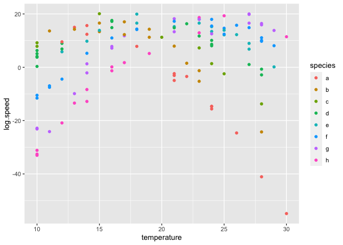

Mixed effects models for movement
================

## Set up

``` r
library(nlme)
library(lme4)
```

    ## Loading required package: Matrix

    ## 
    ## Attaching package: 'lme4'

    ## The following object is masked from 'package:nlme':
    ## 
    ##     lmList

``` r
library(data.table)
library(ggplot2)
library(RColorBrewer)
dat <- fread('data/data_speed.csv')
```

## Simulated data

``` r
params <- data.frame(a = 5, b = 2, w = 5)
sim <- data.table(temperature = sample(10:30, 125, replace = TRUE),
                  species = as.factor(sample(c('a', 'b', 'c', 'd', 'e', 'f', 'g', 'h'), 125, replace = TRUE)))
sim[, mass := pmax(20, as.numeric(species) * 100 + rnorm(.N, 0, 50))]
sim[, log.mass.mg := log(mass)]
sim[, z := as.numeric(species)*2 + 10]
sim[, log.speed := params$a + params$b * log.mass.mg - (temperature -z)^2/params$w + rnorm(.N, 0, 2)]
ranefs = sim[, .(z = unique(z)), by = species]

ggplot(sim, aes(temperature, log.speed, color = species)) +
    geom_point()
```

<!-- -->

### A first model on simulated data

``` r
metabfunc <- function(lmass, temp, a, b, z, w){
    lspeed <- a + b * lmass - (temp - z)^2/w
}
modsim1 <- nlme(log.speed ~ metabfunc(log.mass.mg, temperature, a, b, z, w), 
             random = z ~ 1|species,
             fixed = a + b + w ~ 1,
             start = list(fixed = c(a = 4.8, b = 1.8, w = 4.8)),
             data = sim)

summary(modsim1)
```

    ## Nonlinear mixed-effects model fit by maximum likelihood
    ##   Model: log.speed ~ metabfunc(log.mass.mg, temperature, a, b, z, w) 
    ##  Data: sim 
    ##        AIC     BIC    logLik
    ##   617.6835 631.825 -303.8417
    ## 
    ## Random effects:
    ##  Formula: z ~ 1 | species
    ##                z Residual
    ## StdDev: 19.50473 2.027753
    ## 
    ## Fixed effects: a + b + w ~ 1 
    ##      Value Std.Error  DF  t-value p-value
    ## a 6.577685 2.1720476 115  3.02833   0.003
    ## b 1.795299 0.3599476 115  4.98767   0.000
    ## w 4.811977 0.1267697 115 37.95841   0.000
    ##  Correlation: 
    ##   a      b     
    ## b -0.993       
    ## w  0.134 -0.199
    ## 
    ## Standardized Within-Group Residuals:
    ##         Min          Q1         Med          Q3         Max 
    ## -3.25844887 -0.50632168  0.01797997  0.66003337  2.27733668 
    ## 
    ## Number of Observations: 125
    ## Number of Groups: 8

### Compare estimates to true values

``` r
fixef_est <- summary(modsim1)$tTable
ranef_est <- ranef(modsim1)
ranef_est$species <- rownames(ranef_est)
colnames(ranef_est) <- c('z_est', 'species')

print(data.frame(True = t(params), Est = fixef_est[, 'Value'], StdErr = fixef_est[, 'Std.Error']))
```

    ##   True      Est    StdErr
    ## a    5 6.577685 2.1720476
    ## b    2 1.795299 0.3599476
    ## w    5 4.811977 0.1267697

``` r
print(merge(ranefs, ranef_est))
```

    ##    species  z    z_est
    ## 1:       a 12 11.98675
    ## 2:       b 14 13.98351
    ## 3:       c 16 15.70122
    ## 4:       d 18 18.15094
    ## 5:       e 20 20.02407
    ## 6:       f 22 21.96469
    ## 7:       g 24 24.15703
    ## 8:       h 26 25.71081

## Real data

### Plot

<!-- -->

### Original model

``` r
modorig <- lmer(log.speed ~ log.mass.mg + temperature + I(temperature^2) + (1|chamber:year),
                data = dat)

summary(modorig)
```

    ## Linear mixed model fit by REML ['lmerMod']
    ## Formula: log.speed ~ log.mass.mg + temperature + I(temperature^2) + (1 |  
    ##     chamber:year)
    ##    Data: dat
    ## 
    ## REML criterion at convergence: 202.3
    ## 
    ## Scaled residuals: 
    ##     Min      1Q  Median      3Q     Max 
    ## -3.6696 -0.5286  0.1159  0.6406  1.9485 
    ## 
    ## Random effects:
    ##  Groups       Name        Variance Std.Dev.
    ##  chamber:year (Intercept) 0.002444 0.04943 
    ##  Residual                 0.238691 0.48856 
    ## Number of obs: 125, groups:  chamber:year, 6
    ## 
    ## Fixed effects:
    ##                    Estimate Std. Error t value
    ## (Intercept)      -5.6456956  0.3688196 -15.307
    ## log.mass.mg       0.0940499  0.0432020   2.177
    ## temperature       0.2148894  0.0343683   6.253
    ## I(temperature^2) -0.0047903  0.0008397  -5.705
    ## 
    ## Correlation of Fixed Effects:
    ##             (Intr) lg.ms. tmprtr
    ## log.mass.mg -0.508              
    ## temperature -0.845  0.028       
    ## I(tmprtr^2)  0.807 -0.034 -0.986

### Initial nlme model

Has random intercepts for chamber and year, like lmer model

``` r
metabfunc1 <- function(lmass, temp, a, b, z, w, y){
    lspeed <- a + b * lmass - (temp - 20 + z)^2/w + y
}


mod0 <- nlme(log.speed ~ metabfunc1(log.mass.mg, temperature, a, b, z, w, y), 
             fixed = a + b + w + z ~ 1,
             random = y ~ 1|chamber/year,
             start = list(fixed = c(a =  -5.6, b = 0.09, w = 5, z= 0)),
             data = dat)
summary(mod0)
```

    ## Nonlinear mixed-effects model fit by maximum likelihood
    ##   Model: log.speed ~ metabfunc1(log.mass.mg, temperature, a, b, z, w,      y) 
    ##  Data: dat 
    ##        AIC      BIC    logLik
    ##   186.5743 206.3725 -86.28716
    ## 
    ## Random effects:
    ##  Formula: y ~ 1 | chamber
    ##                  y
    ## StdDev: 0.03118442
    ## 
    ##  Formula: y ~ 1 | year %in% chamber
    ##                  y  Residual
    ## StdDev: 2.7099e-05 0.4816669
    ## 
    ## Fixed effects: a + b + w + z ~ 1 
    ##       Value Std.Error  DF    t-value p-value
    ## a  -3.25297   0.19065 116 -17.062561  0.0000
    ## b   0.09853   0.04267 116   2.309109  0.0227
    ## w 207.16324  35.95629 116   5.761530  0.0000
    ## z  -2.42113   0.70145 116  -3.451594  0.0008
    ##  Correlation: 
    ##   a      b      w     
    ## b -0.933              
    ## w -0.223 -0.024       
    ## z  0.053  0.045 -0.557
    ## 
    ## Standardized Within-Group Residuals:
    ##        Min         Q1        Med         Q3        Max 
    ## -3.7373667 -0.5503689  0.1284667  0.6685728  1.9669249 
    ## 
    ## Number of Observations: 125
    ## Number of Groups: 
    ##           chamber year %in% chamber 
    ##                 2                 6

``` r
ranef(mod0)
```

    ## Level: chamber 
    ##              y
    ## D3  0.01420641
    ## D4 -0.01420639
    ## 
    ## Level: year %in% chamber 
    ##                     y
    ## D3/2018  3.254039e-09
    ## D3/2019  1.129033e-08
    ## D3/2020 -3.816396e-09
    ## D4/2018  1.654236e-09
    ## D4/2019 -7.651192e-09
    ## D4/2020 -4.731001e-09

#### Plot vs. observed

<!-- -->

#### Plot predictions

<!-- -->

### Model with random optimal temperatures

``` r
metabfunc2 <- function(lmass, temp, a, b, z0, z, w){
    lspeed <- a + b * lmass - (temp - z0 - z)^2/w
}


mod1 <- nlme(log.speed ~ metabfunc2(log.mass.mg, temperature, a, b, z0, z, w), 
             fixed = a + b + w + z0 ~ 1,
             random = z ~ 1|species,
             start = list(fixed = c(a =  -3.2, b = 0.09, w = 100, z0= 20)),
             data = dat)
summary(mod1)
```

    ## Nonlinear mixed-effects model fit by maximum likelihood
    ##   Model: log.speed ~ metabfunc2(log.mass.mg, temperature, a, b, z0, z,      w) 
    ##  Data: dat 
    ##        AIC      BIC    logLik
    ##   154.8939 171.8638 -71.44694
    ## 
    ## Random effects:
    ##  Formula: z ~ 1 | species
    ##                z  Residual
    ## StdDev: 2.872955 0.4069914
    ## 
    ## Fixed effects: a + b + w + z0 ~ 1 
    ##        Value Std.Error  DF    t-value p-value
    ## a   -3.18335  0.177076 114 -17.977279  0.0000
    ## b    0.09683  0.040168 114   2.410677  0.0175
    ## w  180.36944 23.391484 114   7.710902  0.0000
    ## z0  24.63126  1.286998 114  19.138544  0.0000
    ##  Correlation: 
    ##    a      b      w     
    ## b  -0.954              
    ## w  -0.237  0.041       
    ## z0 -0.121  0.096  0.296
    ## 
    ## Standardized Within-Group Residuals:
    ##         Min          Q1         Med          Q3         Max 
    ## -3.78142540 -0.63390464  0.06860156  0.63842852  2.14803328 
    ## 
    ## Number of Observations: 125
    ## Number of Groups: 8

``` r
print(ranef(mod1))
```

    ##                         z
    ## A.dorsalis     0.02846113
    ## A.parallelus   1.30601952
    ## C.granulatus   0.26756058
    ## C.nemoralis    3.10641256
    ## H.affinis      1.54704904
    ## N.brevicollis -5.56296212
    ## P.cristatus   -1.51054406
    ## P.melanarius   0.81801271

#### Plot vs. observed

<!-- -->

#### Plot predictions

Each species’ curve is shown with its T\_opt plotted as a triangle at
the bottom. The cross-species average is plotted in black.

    ## NULL

<!-- -->
