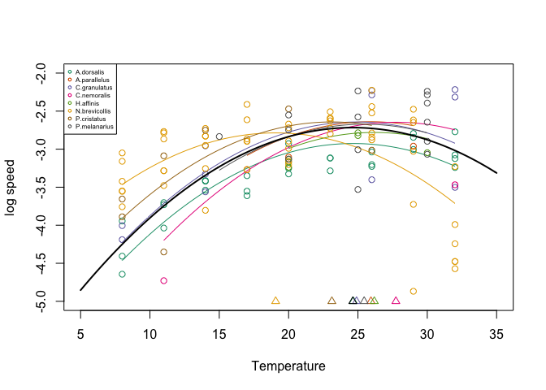

Mixed effects models for movement
================

## Set up

``` r
library(nlme)
library(lme4)
```

    ## Loading required package: Matrix

    ## 
    ## Attaching package: 'lme4'

    ## The following object is masked from 'package:nlme':
    ## 
    ##     lmList

``` r
library(data.table)
library(ggplot2)
library(RColorBrewer)
dat <- fread('data/data_speed.csv')
```

## Simulated data

``` r
params <- data.frame(a = 5, b = 2, w = 5)
sim <- data.table(temperature = sample(10:30, 125, replace = TRUE),
                  species = as.factor(sample(c('a', 'b', 'c', 'd', 'e', 'f', 'g', 'h'), 125, replace = TRUE)))
sim[, mass := pmax(20, as.numeric(species) * 100 + rnorm(.N, 0, 50))]
sim[, log.mass.mg := log(mass)]
sim[, z := as.numeric(species)*2 + 10]
sim[, log.speed := params$a + params$b * log.mass.mg - (temperature -z)^2/params$w + rnorm(.N, 0, 2)]
ranefs = sim[, .(z = unique(z)), by = species]

ggplot(sim, aes(temperature, log.speed, color = species)) +
    geom_point()
```

<!-- -->

### A first model on simulated data

``` r
metabfunc <- function(lmass, temp, a, b, z, w){
    lspeed <- a + b * lmass - (temp - z)^2/w
}
modsim1 <- nlme(log.speed ~ metabfunc(log.mass.mg, temperature, a, b, z, w), 
             random = z ~ 1|species,
             fixed = a + b + w ~ 1,
             start = list(fixed = c(a = 4.8, b = 1.8, w = 4.8)),
             data = sim)

summary(modsim1)
```

    ## Nonlinear mixed-effects model fit by maximum likelihood
    ##   Model: log.speed ~ metabfunc(log.mass.mg, temperature, a, b, z, w) 
    ##  Data: sim 
    ##        AIC      BIC    logLik
    ##   598.9635 613.1051 -294.4818
    ## 
    ## Random effects:
    ##  Formula: z ~ 1 | species
    ##                z Residual
    ## StdDev: 19.50943 1.875644
    ## 
    ## Fixed effects: a + b + w ~ 1 
    ##      Value Std.Error  DF  t-value p-value
    ## a 7.208944 2.2388619 115  3.21991  0.0017
    ## b 1.585157 0.3665965 115  4.32398  0.0000
    ## w 5.182528 0.1366697 115 37.92010  0.0000
    ##  Correlation: 
    ##   a      b     
    ## b -0.994       
    ## w  0.140 -0.184
    ## 
    ## Standardized Within-Group Residuals:
    ##         Min          Q1         Med          Q3         Max 
    ## -2.01833315 -0.65559766 -0.07565227  0.56991874  2.62046164 
    ## 
    ## Number of Observations: 125
    ## Number of Groups: 8

### Compare estimates to true values

``` r
fixef_est <- summary(modsim1)$tTable
ranef_est <- ranef(modsim1)
ranef_est$species <- rownames(ranef_est)
colnames(ranef_est) <- c('z_est', 'species')

print(data.frame(True = t(params), Est = fixef_est[, 'Value'], StdErr = fixef_est[, 'Std.Error']))
```

    ##   True      Est    StdErr
    ## a    5 7.208944 2.2388619
    ## b    2 1.585157 0.3665965
    ## w    5 5.182528 0.1366697

``` r
print(merge(ranefs, ranef_est))
```

    ##    species  z    z_est
    ## 1:       a 12 11.88746
    ## 2:       b 14 13.49746
    ## 3:       c 16 15.94813
    ## 4:       d 18 17.77766
    ## 5:       e 20 19.58216
    ## 6:       f 22 22.07463
    ## 7:       g 24 24.33200
    ## 8:       h 26 26.23038

## Real data

### Plot

``` r
ggplot(dat, aes(temperature, log.speed, color = species)) +
    geom_point()
```

<!-- -->

### Original model

``` r
modorig <- lmer(log.speed ~ log.mass.mg + temperature + I(temperature^2) + (1|chamber:year),
                data = dat)

summary(modorig)
```

    ## Linear mixed model fit by REML ['lmerMod']
    ## Formula: log.speed ~ log.mass.mg + temperature + I(temperature^2) + (1 |  
    ##     chamber:year)
    ##    Data: dat
    ## 
    ## REML criterion at convergence: 202.3
    ## 
    ## Scaled residuals: 
    ##     Min      1Q  Median      3Q     Max 
    ## -3.6696 -0.5286  0.1159  0.6406  1.9485 
    ## 
    ## Random effects:
    ##  Groups       Name        Variance Std.Dev.
    ##  chamber:year (Intercept) 0.002444 0.04943 
    ##  Residual                 0.238691 0.48856 
    ## Number of obs: 125, groups:  chamber:year, 6
    ## 
    ## Fixed effects:
    ##                    Estimate Std. Error t value
    ## (Intercept)      -5.6456956  0.3688196 -15.307
    ## log.mass.mg       0.0940499  0.0432020   2.177
    ## temperature       0.2148894  0.0343683   6.253
    ## I(temperature^2) -0.0047903  0.0008397  -5.705
    ## 
    ## Correlation of Fixed Effects:
    ##             (Intr) lg.ms. tmprtr
    ## log.mass.mg -0.508              
    ## temperature -0.845  0.028       
    ## I(tmprtr^2)  0.807 -0.034 -0.986

### Initial nlme model

Has random intercepts for chamber and year, like lmer model

``` r
metabfunc1 <- function(lmass, temp, a, b, z, w, y){
    lspeed <- a + b * lmass - (temp - 20 + z)^2/w + y
}


mod0 <- nlme(log.speed ~ metabfunc1(log.mass.mg, temperature, a, b, z, w, y), 
             fixed = a + b + w + z ~ 1,
             random = y ~ 1|chamber/year,
             start = list(fixed = c(a =  -5.6, b = 0.09, w = 5, z= 0)),
             data = dat)
summary(mod0)
```

    ## Nonlinear mixed-effects model fit by maximum likelihood
    ##   Model: log.speed ~ metabfunc1(log.mass.mg, temperature, a, b, z, w,      y) 
    ##  Data: dat 
    ##        AIC      BIC    logLik
    ##   186.5743 206.3725 -86.28716
    ## 
    ## Random effects:
    ##  Formula: y ~ 1 | chamber
    ##                  y
    ## StdDev: 0.03118442
    ## 
    ##  Formula: y ~ 1 | year %in% chamber
    ##                  y  Residual
    ## StdDev: 2.7099e-05 0.4816669
    ## 
    ## Fixed effects: a + b + w + z ~ 1 
    ##       Value Std.Error  DF    t-value p-value
    ## a  -3.25297   0.19065 116 -17.062561  0.0000
    ## b   0.09853   0.04267 116   2.309109  0.0227
    ## w 207.16324  35.95629 116   5.761530  0.0000
    ## z  -2.42113   0.70145 116  -3.451594  0.0008
    ##  Correlation: 
    ##   a      b      w     
    ## b -0.933              
    ## w -0.223 -0.024       
    ## z  0.053  0.045 -0.557
    ## 
    ## Standardized Within-Group Residuals:
    ##        Min         Q1        Med         Q3        Max 
    ## -3.7373667 -0.5503689  0.1284667  0.6685728  1.9669249 
    ## 
    ## Number of Observations: 125
    ## Number of Groups: 
    ##           chamber year %in% chamber 
    ##                 2                 6

``` r
ranef(mod0)
```

    ## Level: chamber 
    ##              y
    ## D3  0.01420641
    ## D4 -0.01420639
    ## 
    ## Level: year %in% chamber 
    ##                     y
    ## D3/2018  3.254039e-09
    ## D3/2019  1.129033e-08
    ## D3/2020 -3.816396e-09
    ## D4/2018  1.654236e-09
    ## D4/2019 -7.651192e-09
    ## D4/2020 -4.731001e-09

#### Plot vs. observed

``` r
dat[, pred_mod0 := predict(mod0)]
ggplot(dat, aes(log.speed, pred_mod0, color = species)) +
    geom_point() +
    geom_abline(intercept = 0, slope = 1)
```

<!-- -->

#### Plot predictions

``` r
ggplot(dat, aes(temperature, pred_mod0, color = species)) +
    geom_point()
```

<!-- -->

### Model with random optimal temperatures

``` r
metabfunc2 <- function(lmass, temp, a, b, z0, z, w){
    lspeed <- a + b * lmass - (temp - z0 - z)^2/w
}


mod1 <- nlme(log.speed ~ metabfunc2(log.mass.mg, temperature, a, b, z0, z, w), 
             fixed = a + b + w + z0 ~ 1,
             random = z ~ 1|species,
             start = list(fixed = c(a =  -3.2, b = 0.09, w = 100, z0= 20)),
             data = dat)
summary(mod1)
```

    ## Nonlinear mixed-effects model fit by maximum likelihood
    ##   Model: log.speed ~ metabfunc2(log.mass.mg, temperature, a, b, z0, z,      w) 
    ##  Data: dat 
    ##        AIC      BIC    logLik
    ##   154.8939 171.8638 -71.44694
    ## 
    ## Random effects:
    ##  Formula: z ~ 1 | species
    ##                z  Residual
    ## StdDev: 2.872955 0.4069914
    ## 
    ## Fixed effects: a + b + w + z0 ~ 1 
    ##        Value Std.Error  DF    t-value p-value
    ## a   -3.18335  0.177076 114 -17.977279  0.0000
    ## b    0.09683  0.040168 114   2.410677  0.0175
    ## w  180.36944 23.391484 114   7.710902  0.0000
    ## z0  24.63126  1.286998 114  19.138544  0.0000
    ##  Correlation: 
    ##    a      b      w     
    ## b  -0.954              
    ## w  -0.237  0.041       
    ## z0 -0.121  0.096  0.296
    ## 
    ## Standardized Within-Group Residuals:
    ##         Min          Q1         Med          Q3         Max 
    ## -3.78142540 -0.63390464  0.06860156  0.63842852  2.14803328 
    ## 
    ## Number of Observations: 125
    ## Number of Groups: 8

``` r
print(ranef(mod1))
```

    ##                         z
    ## A.dorsalis     0.02846113
    ## A.parallelus   1.30601952
    ## C.granulatus   0.26756058
    ## C.nemoralis    3.10641256
    ## H.affinis      1.54704904
    ## N.brevicollis -5.56296212
    ## P.cristatus   -1.51054406
    ## P.melanarius   0.81801271

#### Plot vs. observed

``` r
dat[, pred_mod1 := predict(mod1)]

ggplot(dat, aes(log.speed, pred_mod1, color = species)) +
    geom_point() +
    geom_abline(intercept = 0, slope = 1)
```

<!-- -->

#### Plot predictions

``` r
preds <- as.data.table(expand.grid(temperature = seq(5, 35, by = 0.1), 
                                   species = unique(dat$species), 
                                   chamber = unique(dat$chamber), year = unique(dat$year),
                                   stringsAsFactors = FALSE))
mass <- dat[, .(log.mass.mg = mean(log.mass.mg)), by = species]
preds <- merge(preds, mass)

preds[, pred_mod1 := predict(mod1, newdata = preds)]

ranefs <- ranef(mod1)
ranefs$species = rownames(ranefs)
ranefs <- as.data.table(ranefs)

cols <- brewer.pal(8, 'Dark2')
sp <- unique(preds$species)

plot(0,0, xlim=c(5,35), ylim = c(-5,-2), xlab = 'Temperature', ylab = 'log speed')
for(i in 1:length(sp)){
    minT <- dat[species == sp[i], min(temperature)]
    maxT <- dat[species == sp[i], max(temperature)]
    dat[species == sp[i], points(temperature, log.speed, col = cols[i])]
    ave <- preds[species == sp[i] & 
                     temperature >= minT & temperature <= maxT &
                     !is.na(pred_mod1), .(pred_mod1 = mean(pred_mod1)), by = temperature]
  ave[, lines(temperature, pred_mod1, col = cols[i])]
  ranefs[species == sp[i], points(fixef(mod1)[4] + z, -5, col = cols[i], pch = 2)]
}
legend('topleft', legend = sp, pch = 1, col = cols, cex = 0.5)
```

<!-- -->

### Model with random optimal temperatures and chamber and year effects

Not working well. Assigns most of the random effects to year differences
rather than species differences. Would be better to have separate random
effects for the optimal temperature (by species) and for an intercept
(by chamber/year).

``` r
metabfunc3 <- function(lmass, temp, a, b, z0, z, w){
    lspeed <- a + b * lmass - (temp - z0 + z)^2/w
}


mod2 <- nlme(log.speed ~ metabfunc3(log.mass.mg, temperature, a, b, z0, z, w), 
             fixed = a + b + w + z0 ~ 1,
             random = z ~1|species/chamber/year,
             start = list(fixed = c(a =  -3.2, b = 0.09, w = 100, z0= 20)),
             data = dat)
summary(mod2)
```

    ## Nonlinear mixed-effects model fit by maximum likelihood
    ##   Model: log.speed ~ metabfunc3(log.mass.mg, temperature, a, b, z0, z,      w) 
    ##  Data: dat 
    ##        AIC      BIC    logLik
    ##   148.6538 171.2803 -66.32691
    ## 
    ## Random effects:
    ##  Formula: z ~ 1 | species
    ##                   z
    ## StdDev: 0.001968713
    ## 
    ##  Formula: z ~ 1 | chamber %in% species
    ##                    z
    ## StdDev: 1.176893e-05
    ## 
    ##  Formula: z ~ 1 | year %in% chamber %in% species
    ##                z  Residual
    ## StdDev: 3.244388 0.3746469
    ## 
    ## Fixed effects: a + b + w + z0 ~ 1 
    ##        Value Std.Error  DF    t-value p-value
    ## a   -3.18915  0.162064 105 -19.678349  0.0000
    ## b    0.10333  0.037014 105   2.791699  0.0062
    ## w  172.59041 19.766269 105   8.731562  0.0000
    ## z0  24.21939  1.047326 105  23.124981  0.0000
    ##  Correlation: 
    ##    a      b      w     
    ## b  -0.954              
    ## w  -0.221  0.025       
    ## z0 -0.088  0.059  0.278
    ## 
    ## Standardized Within-Group Residuals:
    ##        Min         Q1        Med         Q3        Max 
    ## -3.4065079 -0.6169082  0.1343473  0.5521325  3.0385260 
    ## 
    ## Number of Observations: 125
    ## Number of Groups: 
    ##                        species           chamber %in% species 
    ##                              8                             16 
    ## year %in% chamber %in% species 
    ##                             17

``` r
print(ranef(mod2))
```

    ## Level: species 
    ##                           z
    ## A.dorsalis    -4.057643e-08
    ## A.parallelus  -9.156229e-07
    ## C.granulatus  -4.273710e-07
    ## C.nemoralis   -7.841352e-07
    ## H.affinis     -1.006142e-06
    ## N.brevicollis  3.817253e-06
    ## P.cristatus    7.166862e-08
    ## P.melanarius  -7.150794e-07
    ## 
    ## Level: chamber %in% species 
    ##                              z
    ## A.dorsalis/D3    -5.609541e-12
    ## A.dorsalis/D4     4.159482e-12
    ## A.parallelus/D3  -2.010628e-11
    ## A.parallelus/D4  -1.261486e-11
    ## C.granulatus/D3   1.971614e-13
    ## C.granulatus/D4  -1.546990e-11
    ## C.nemoralis/D3    3.086936e-11
    ## C.nemoralis/D4   -5.889159e-11
    ## H.affinis/D3     -1.142367e-11
    ## H.affinis/D4     -2.453231e-11
    ## N.brevicollis/D3  4.172448e-11
    ## N.brevicollis/D4  9.469070e-11
    ## P.cristatus/D3    3.172086e-11
    ## P.cristatus/D4   -2.915967e-11
    ## P.melanarius/D3  -1.996794e-11
    ## P.melanarius/D4  -5.586478e-12
    ## 
    ## Level: year %in% chamber %in% species 
    ##                                 z
    ## A.dorsalis/D3/2020    -0.42615839
    ## A.dorsalis/D4/2020     0.31599701
    ## A.parallelus/D3/2020  -1.52747946
    ## A.parallelus/D4/2020  -0.95835455
    ## C.granulatus/D3/2020   0.01497841
    ## C.granulatus/D4/2020  -1.17525238
    ## C.nemoralis/D3/2019    2.34515426
    ## C.nemoralis/D4/2019   -4.47401101
    ## H.affinis/D3/2018     -0.86785937
    ## H.affinis/D4/2018     -1.86372652
    ## N.brevicollis/D3/2019  3.16982061
    ## N.brevicollis/D4/2019  7.19367906
    ## P.cristatus/D3/2019    2.40984259
    ## P.cristatus/D4/2019   -3.03723452
    ## P.cristatus/D4/2020    0.82196581
    ## P.melanarius/D3/2018  -1.51697013
    ## P.melanarius/D4/2018  -0.42440635

#### Plot predictions

``` r
preds <- as.data.table(expand.grid(temperature = seq(5, 35, by = 0.1), 
                                   species = unique(dat$species), 
                                   chamber = unique(dat$chamber), year = unique(dat$year),
                                   stringsAsFactors = FALSE))
mass <- dat[, .(log.mass.mg = mean(log.mass.mg)), by = species]
preds <- merge(preds, mass)

preds[, pred_mod2 := predict(mod2, newdata = preds)]

cols <- brewer.pal(8, 'Dark2')
sp <- unique(preds$species)

plot(0,0, xlim=c(5,35), ylim = c(-5,-2), xlab = 'Temperature', ylab = 'log speed')
for(i in 1:length(sp)){
    minT <- dat[species == sp[i], min(temperature)]
    maxT <- dat[species == sp[i], max(temperature)]
    dat[species == sp[i], points(temperature, log.speed, col = cols[i])]
    ave <- preds[species == sp[i] & 
                     temperature >= minT & temperature <= maxT &
                     !is.na(pred_mod2), .(pred_mod2 = mean(pred_mod2)), by = temperature]
  ave[, lines(temperature, pred_mod2, col = cols[i])]
  
}
```

<!-- -->
